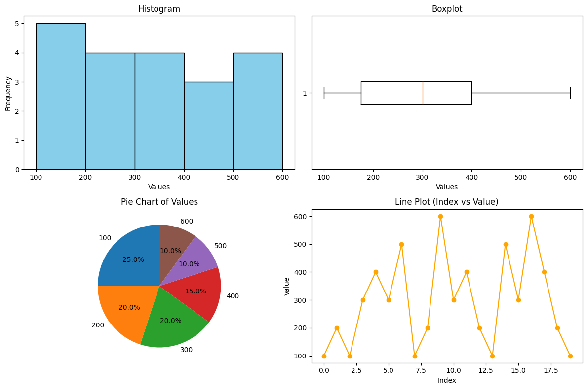

# 📊 Statistical Summary Tool – NumPy

Welcome to the **Statistical Summary Tool**, a Python-based data analysis project built using **NumPy** and **Matplotlib**. This tool allows you to compute key descriptive statistics and visualize the results with multiple charts.

---

## 🚀 Features

✅ Accepts user input or a predefined NumPy array  
✅ Computes descriptive statistics:
- Count of non-zero elements
- Mean, Median
- Standard Deviation, Variance
- Minimum, Maximum
- 25th and 75th Percentiles

✅ Generates visualizations:
- 📊 Histogram  
- 📈 Line Plot  
- 📦 Boxplot  
- 🥧 Pie Chart (if unique values ≤ 8)

---

## 🛠️ Technologies Used

- Python 3
- NumPy
- Matplotlib
- Jupyter Notebook

---

## 📁 Project Structure

```
📦 Statistical-Summary-Tool-Numpy
│
├── Statistical_Summary_Tool.ipynb    # Main tool notebook
├── README.md                         # Documentation file
├── sample_output.png                 # Optional visual output screenshot
```

---

## 🧪 Sample Input

```python
arr_1d = np.array([
    100, 200, 100, 300, 400, 300, 500, 100, 200, 600,
    300, 400, 200, 100, 500, 300, 600, 400, 200, 100
])
```

---

## 📷 Sample Output


---

## 📌 How to Use

1. Clone the repository:
   ```bash
   git clone https://github.com/iammarafzal/Statistical-Summary-Tool-Numpy.git
   ```

2. Open the notebook:
   ```bash
   jupyter notebook Statistical_Summary_Tool.ipynb
   ```

3. Run all cells to:
   - Input a NumPy array
   - View statistical summary
   - Generate visual charts

---

## 🔮 Future Enhancements

- Load data from `.csv` files  
- Export results to `.txt` or `.csv`  
- Add Mode using `scipy.stats.mode()`  
- GUI version using Streamlit or Tkinter  

---

## 👨‍💻 Author

**Ammar Afzal**  
🎓 BS Computer Science | Python & Data Science Enthusiast  
🔗 [LinkedIn](https://www.linkedin.com/in/ammar-afzal277)  
